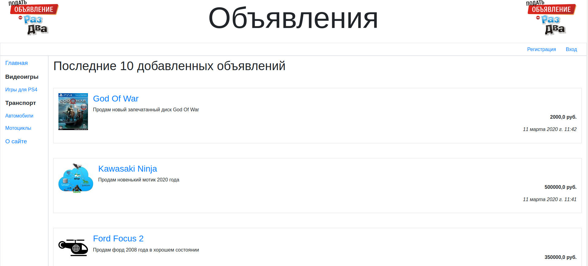

# ElTablo
Электронная доска объявлений, реализованная на Django

​

## Текущая реализация
* Регистрация и авторизация пользователя(+отправка на электронную почту подтверждения о регистрации)
* Изменение данных в профиле пользователя
* Добавление объявления с выбором нужной рубрики
* Редактирование объявления
* Удаление объявления
* Вывод последних объявлений на главной странице
* Детальное представление каждого из объявлений
* Комментарии к объявлениям
* Веб-служба REST API: Запрос последних объявлений, запрос конкретного объявления, публикация комментария, запрос информации о комментарии

## Что нужно еще реализовать
* Авторизация через ВК
* Описать шаблоны изменения, удаления, детализации объявления в профиле пользователя
* Описать шаблоны для оповещений о новых комментариях
* Реализовать инструменты для администратирования комментариев

## Сборка и запуск проекта
* Склонировать репозиторий
* Создать виртуальное окружение
* Установить зависимости - `pip3 install -r requirements.txt`
* Сделать миграции
* Запустить - `python3 manage.py runserver`
